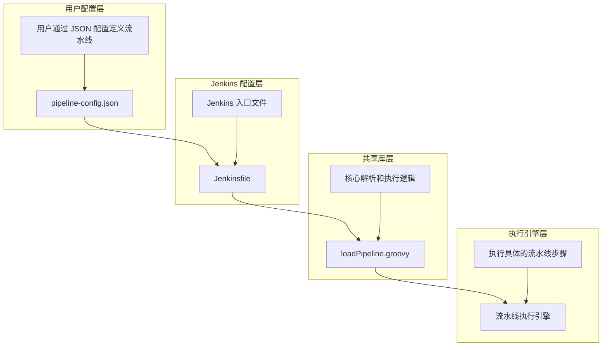

# Jenkins Pipeline Generic Step

jenkins 的流水线需要使用用户友好的 configuration 配置进行设置，目前使用的方案是使用 json 文件来配置流水线。

想要达到 github action 的类似架构效果，请实现项目架构。

## 项目目标

1. **步骤原子化**：将 Jenkins 流水线中的每个步骤拆分为独立的、可复用的原子操作。每个原子操作应具有明确的输入和输出，便于组合和重用。
2. **可配置性**：通过 JSON 配置文件来定义流水线的步骤和参数，使得流水线的配置更加灵活和易于维护。
3. **模块化设计**：将流水线的各个功能模块化，便于扩展和维护。每个模块应独立开发、测试和部署。
4. **与 GitHub Actions 类似**：借鉴 GitHub Actions 的架构设计，提供类似的配置体验和功能。

## 系统架构

项目的整体架构如下图所示：



系统分为四个主要层次：

1. **用户配置层**
   - 包含 `pipeline-config.json`
   - 用户通过 JSON 配置定义流水线

2. **Jenkins 配置层**
   - 包含 `Jenkinsfile`
   - 作为 Jenkins 的入口文件

3. **共享库层**
   - 包含 `loadPipeline.groovy`
   - 实现核心解析和执行逻辑

4. **执行引擎层**
   - 包含流水线执行引擎
   - 负责执行具体的流水线步骤

## 实现方案

1. **JSON 配置文件**：使用 JSON 文件来定义流水线的步骤和参数。每个步骤对应一个原子操作，配置文件中应包含步骤的类型、输入参数和输出结果。
2. **步骤库**：建立一个步骤库，包含常用的原子操作，如代码拉取、构建、测试、部署等。每个步骤应独立实现，并通过配置文件进行组合。
3. **流水线引擎**：开发一个流水线引擎，负责解析 JSON 配置文件，并按照配置执行相应的步骤。引擎应支持步骤的并行执行、条件判断和错误处理。
4. **扩展机制**：提供扩展机制，允许用户自定义步骤并集成到流水线中。扩展步骤应遵循统一的接口规范，便于集成和管理。

## 使用方法

1. 在您的 GitHub 仓库中创建 `pipeline-config.json` 文件
2. 按照以下格式配置您的流水线：

```json
{
  "name": "流水线名称",
  "description": "流水线描述",
  "shared_libraries": [
    {
      "name": "库名称",
      "version": "版本"
    }
  ],
  "stages": [
    {
      "name": "阶段名称",
      "parallel": true/false,
      "steps": [
        {
          "name": "步骤名称",
          "type": "shell/shared_library",
          "command": "shell命令",  // 当 type 为 shell 时
          "library": "库名称",     // 当 type 为 shared_library 时
          "function": "函数名称",   // 当 type 为 shared_library 时
          "parameters": {          // 当 type 为 shared_library 时
            "参数名": "参数值"
          }
        }
      ]
    }
  ]
}
```

3. 在 Jenkins 中配置：
   - 安装 "Pipeline: Shared Groovy Libraries" 插件
   - 在 Jenkins 系统配置中添加共享库
   - 创建一个新的 Pipeline Job
   - 在 Job 配置中选择 "Pipeline script from SCM"
   - 配置 Git 仓库和分支
   - 在 "Script Path" 中指定 `Jenkinsfile`

## 示例

查看 `pipeline-config.json` 文件获取完整示例。

## 注意事项

- 确保您的 Jenkins 实例已配置好相应的 shared libraries
- 并行执行的 stages 中的步骤应该是相互独立的
- 建议在本地测试配置后再提交到仓库
- 确保 Jenkins 有权限访问您的 Git 仓库
- 建议使用 Jenkins 的凭证管理来存储敏感信息